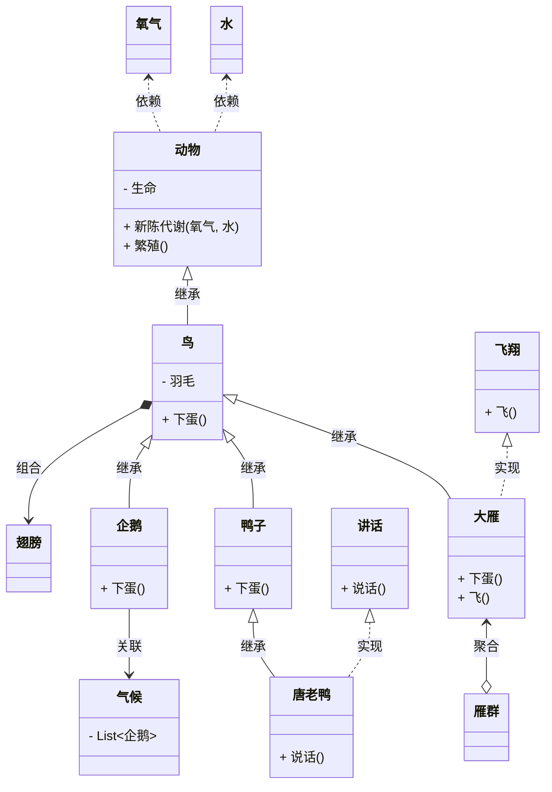
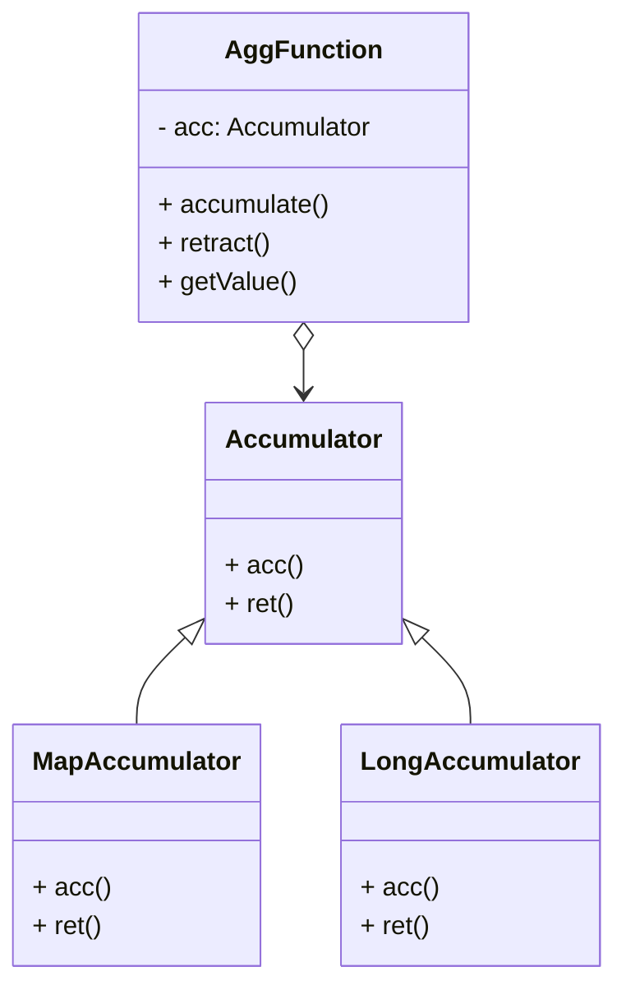
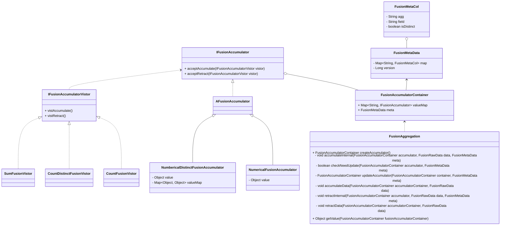

## 继承(泛化)

继承关系，表示子类如何特化父类的所有特征和行为

## 实现

类与接口的关系，表示类是接口所有特征和行为的实现

## 关联

拥有关系，一个类知道另一个类的属性和方法

## 聚合

整体与部分的关系

## 组合

整体与部分的关系，比聚合的关系还要强，要求聚合关系中代表整体的对象负责代表部分的对象的生命周期，没有整体就不存在部分

## 依赖

使用关系，一般是局部变量，方法的参数或者静态方法的调用

